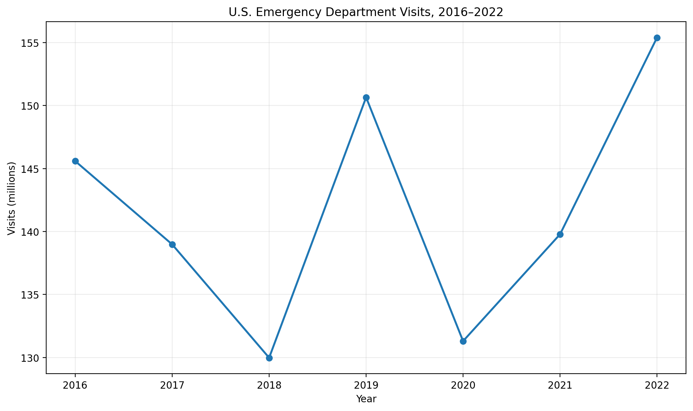

# U.S. Emergency Department Visit Trends
### Snowflake | SQL | Python | Pandas | Matplotlib

## Project Overview

This project analyzes annual U.S. emergency department visit trends using Snowflake for cloud data storage and transformation, SQL for data cleaning and analysis, and Python for downstream analysis and visualization.

The project demonstrates an end-to-end analytics workflow:

Raw Data → Snowflake → Clean Analytics View → SQL Analysis → Python/Pandas → Visualization

## Analytical Questions

The analysis focuses on:

- How did total U.S. emergency department visits change from 2016–2022?
- Which years experienced the largest increases and decreases?
- How can Snowflake and Python be combined into an end-to-end analytics workflow?

## Technology Stack

- Snowflake
- SQL
- Python
- Pandas
- Matplotlib
- Snowflake Python Connector
- Git
- GitHub

## Data Architecture

The project separates raw data from analysis-ready data.

### RAW Layer

Source data is stored in:

`PORTFOLIO_DB.RAW.ER_VISITS`

### ANALYTICS Layer

A cleaned Snowflake view was created:

`PORTFOLIO_DB.ANALYTICS.ER_VISITS_CLEAN`

The view standardizes fields and converts the source reliability indicator into a Boolean value for easier filtering.

## SQL Analysis

Annual emergency department visits were isolated using:

- `measure = 'All diagnoses'`
- `demographic_group = 'Total'`
- `subgroup = 'All visits'`
- `estimate_type = 'Visit count'`
- reliable estimates only

Year-over-year changes were calculated with the SQL `LAG()` window function.

Metrics include:

- annual visit count
- previous-year visit count
- absolute change
- percentage change

## Results

| Year | Visits | YoY Change |
|---|---:|---:|
| 2016 | 145.6M | — |
| 2017 | 139.0M | -4.54% |
| 2018 | 130.0M | -6.48% |
| 2019 | 150.7M | +15.91% |
| 2020 | 131.3M | -12.85% |
| 2021 | 139.8M | +6.46% |
| 2022 | 155.4M | +11.17% |

## Key Findings

Emergency department utilization changed substantially during the period analyzed.

- Visits declined from approximately 145.6 million in 2016 to 130.0 million in 2018.
- 2019 experienced the largest percentage increase in the dataset at approximately 15.91%.
- 2020 experienced the largest annual decline at approximately 12.85%.
- Visits recovered during 2021 and 2022.
- 2022 reached approximately 155.4 million visits, the highest annual total in the analyzed period.

## Visualization



## Python Analysis

Python connects to Snowflake and retrieves the analytical dataset into Pandas.

The analysis script:

1. connects to Snowflake
2. executes the analytical query
3. loads the results into a Pandas DataFrame
4. exports the results to CSV
5. generates the trend visualization

The password is entered interactively at runtime rather than stored in source code.

## Repository Structure

```text
snowflake-er-visits-analysis/
├── README.md
├── analyze_er_visits.py
├── connect_test.py
├── requirements.txt
├── sql/
│   ├── 01_setup.sql
│   ├── 02_clean.sql
│   └── 03_analysis.sql
└── outputs/
    ├── er_visit_trends.csv
    └── er_visit_trends.png
```

## SQL Workflow

`01_setup.sql`

Creates the Snowflake database, schemas, and warehouse context used by the project.

`02_clean.sql`

Creates the analysis-ready Snowflake view and performs data cleaning.

`03_analysis.sql`

Performs the analytical queries and calculates year-over-year changes.

## Security Practices

Credentials are not committed to the repository.

Snowflake passwords are requested interactively using Python's `getpass` module.

Local environment and credential-related files are excluded through `.gitignore`.

## Snowflake Cost Management

This project used an X-Small Snowflake warehouse.

Cost-control practices include:

- using the smallest appropriate warehouse
- enabling auto-suspend
- enabling auto-resume
- avoiding unnecessary warehouse runtime
- separating compute from storage considerations
- monitoring warehouse usage during development

These practices are important because Snowflake compute consumption is based on warehouse usage rather than simply whether a user is logged into the interface.

## Challenges and Lessons Learned

### Authentication

Initial Python connectivity using browser-based authentication produced a SAML identity-provider error.

The connection workflow was changed to username/password authentication with the password entered securely at runtime.

### Local Python Environment

The local environment produced compatibility and deprecation warnings related to Python 3.9 and SSL libraries.

The warnings highlighted the importance of maintaining a current Python runtime and dependency environment.

### Pandas / Snowflake Integration

Pandas produced a warning when using the Snowflake DBAPI connection directly with `read_sql()`.

For a production implementation, SQLAlchemy or Snowflake-supported Pandas integration would provide a cleaner interface.

### Cost Awareness

Working with a cloud data warehouse introduced an important operational consideration: compute resources can generate usage costs.

The warehouse was configured with auto-suspend to reduce unnecessary compute consumption.

## Reproducing the Project

Clone the repository:

```bash
git clone https://github.com/hanjre/snowflake-er-visits-analysis.git
cd snowflake-er-visits-analysis
```

Create and activate a virtual environment, then install the project dependencies:

```bash
python3 -m venv .venv
source .venv/bin/activate
pip install -r requirements.txt
```

A Snowflake account and equivalent source dataset are required to execute the Snowflake portions of the pipeline.

## Future Improvements

Potential extensions include:

- demographic analysis of emergency department utilization
- diagnosis-level trend analysis
- confidence interval visualization
- automated data pipelines
- SQLAlchemy-based Snowflake connectivity
- dashboard development
- expanded cost and query-performance monitoring
